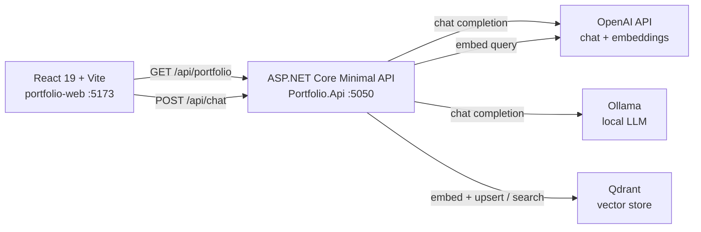
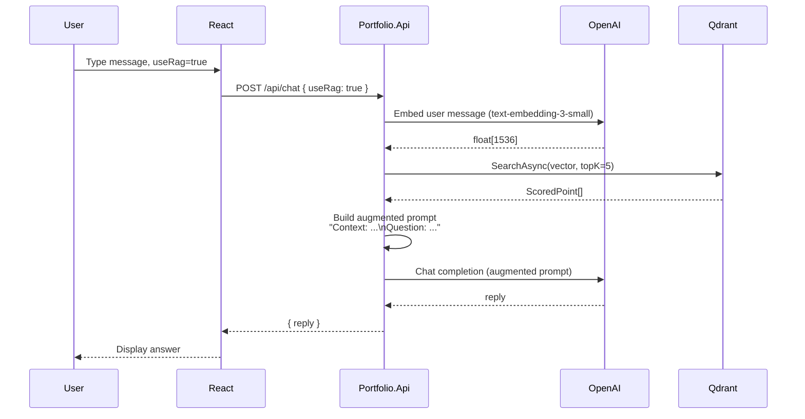
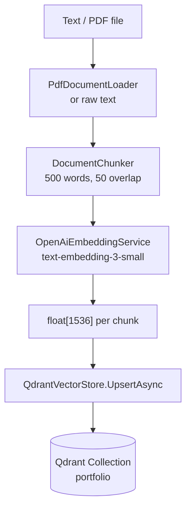
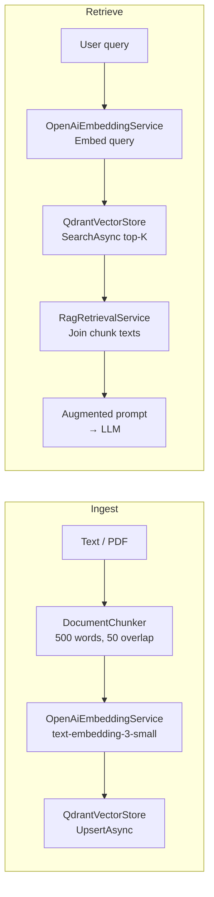

# Portfolio RAG App

A full-stack portfolio website with an AI-powered chat assistant backed by Retrieval-Augmented Generation (RAG). The backend is built with **.NET 10 / ASP.NET Core Minimal API**, the frontend with **React 19 + Vite**, and the vector store is **Qdrant**.

---

## Table of Contents

- [Architecture](#architecture)
- [Features](#features)
- [RAG Checklist](#rag-checklist)
- [Prerequisites](#prerequisites)
- [Getting Started](#getting-started)
- [API Reference](#api-reference)
- [RAG Pipeline](#rag-pipeline)
- [Running Tests](#running-tests)
- [Project Structure](#project-structure)
- [Development Notes](#development-notes)

---

## Architecture

### System Overview



### Request Flow — RAG-augmented Chat



### Ingestion Pipeline



### Projects

| Project | Description |
|---|---|
| `Portfolio.Api` | ASP.NET Core Minimal API — chat, ingestion, and RAG retrieval |
| `Portfolio.Tests` | xUnit unit tests with NSubstitute mocks |
| `portfolio-web` | React 19 + Vite single-page app |

---

## Features

- **Portfolio page** — fetches owner info, technologies, and highlights from the API
- **AI Chat** — supports OpenAI (`gpt-4o-mini` default) and local Ollama models
- **RAG-augmented chat** — set `useRag: true` to ground replies in ingested documents
- **Document ingestion** — ingest plain text or PDF files into Qdrant
- **Vector search** — query the Qdrant collection directly via `/api/rag/search`

---

## RAG Checklist

### Phase 1 — Foundation ✅
- [x] `GET /api/portfolio` endpoint serving portfolio data
- [x] `POST /api/chat` with OpenAI and Ollama provider routing
- [x] React UI with provider selector and chat window
- [x] Vite proxy for `/api` requests

### Phase 2 — Ingestion Pipeline ✅
- [x] `DocumentChunker` — split text into overlapping word-based chunks
- [x] `PdfDocumentLoader` — extract text from PDF via PdfPig
- [x] `OpenAiEmbeddingService` — embed chunks with `text-embedding-3-small` (1536-dim)
- [x] `QdrantVectorStore` — upsert points, ensure collection, in-memory collection cache
- [x] `IngestionService` — orchestrate load → chunk → embed → upsert
- [x] `POST /api/rag/ingest` endpoint (text + PDF)
- [x] Unit tests: `DocumentChunkerTests`, `IngestionServiceTests`

### Phase 3 — Retrieval & Augmentation ✅
- [x] `RagRetrievalService` — embed query → search Qdrant → return joined context string
- [x] `POST /api/rag/search` endpoint for raw semantic search
- [x] `ChatAgentService` updated — prepend RAG context when `useRag: true`
- [x] `ChatRequest` extended with optional `useRag` flag
- [x] Unit tests: `RagRetrievalServiceTests` (context join, empty results, topK, missing payload)

### Phase 4 — Frontend RAG Integration 🔲
- [ ] Add RAG toggle (checkbox/switch) to the React chat UI
- [ ] Pass `useRag` flag in `/api/chat` request body
- [ ] Display source attribution from retrieved chunks

### Phase 5 — Production Hardening 🔲
- [ ] Authentication / API key guard on ingest endpoints
- [ ] Rate limiting on `/api/chat`
- [ ] Structured logging (Serilog / OpenTelemetry)
- [ ] Docker Compose for API + Qdrant
- [ ] CI/CD pipeline (GitHub Actions)

---

## Prerequisites

| Tool | Version |
|---|---|
| .NET SDK | 10.0+ |
| Node.js | 18+ |
| Docker | For running Qdrant locally (optional) |
| OpenAI API key | For chat and embeddings |
| Ollama | Optional, for local LLM inference |

---

## Getting Started

### 1. Clone the repository

```bash
git clone https://github.com/thanhtungngn/Porfolio.git
cd Porfolio
```

### 2. Configure the API

Fill in your secrets in `Portfolio.Api/appsettings.json` or set environment variables:

```bash
# Used for both chat (OpenAI provider) and RAG embeddings
OPENAI_API_KEY=sk-...
```

`appsettings.json` reference:

```json
{
  "ChatProviders": {
    "OpenAI": {
      "Endpoint": "https://api.openai.com/v1/chat/completions",
      "DefaultModel": "gpt-4o-mini",
      "ApiKey": ""
    },
    "Ollama": {
      "Endpoint": "http://localhost:11434/api/chat",
      "DefaultModel": "llama3.2"
    }
  },
  "Rag": {
    "OpenAiEmbedding": {
      "EmbeddingModel": "text-embedding-3-small",
      "EmbeddingEndpoint": "https://api.openai.com/v1/embeddings",
      "ApiKey": ""
    },
    "Qdrant": {
      "Host": "your-qdrant-host",
      "Port": 6334,
      "CollectionName": "portfolio",
      "ApiKey": ""
    }
  }
}
```

### 3. Run Qdrant (local)

```bash
docker run -d -p 6333:6333 -p 6334:6334 qdrant/qdrant
```

For local Qdrant update the config:
```json
"Qdrant": { "Host": "localhost", "Port": 6334, "ApiKey": "" }
```

### 4. Start the API

```bash
cd Portfolio.Api
dotnet run
```

API runs at `http://localhost:5050`. Scalar API docs at `http://localhost:5050/scalar` (development only).

### 5. Start the frontend

```bash
cd portfolio-web
npm install
npm run dev
```

Frontend runs at `http://localhost:5173` and proxies `/api` requests to the backend.

---

## API Reference

### `GET /api/portfolio`
Returns the portfolio owner's info, technologies, highlights, and contact details.

---

### `POST /api/chat`
Chat with an LLM provider, optionally grounded with RAG context.

**Request:**
```json
{
  "provider": "openai",
  "message": "What technologies do you use?",
  "model": "gpt-4o-mini",
  "useRag": true
}
```

| Field | Required | Description |
|---|---|---|
| `provider` | Yes | `"openai"` or `"ollama"` |
| `message` | Yes | User message |
| `model` | No | Overrides the default model |
| `useRag` | No | `false` by default; when `true`, retrieves top-5 context chunks from Qdrant and prepends them to the prompt |

**Response:**
```json
{ "reply": "..." }
```

---

### `POST /api/rag/ingest`
Ingests text or a PDF file into the Qdrant vector store.

**Request (text):**
```json
{ "text": "Your content here...", "source": "manual" }
```

**Request (PDF):**
```json
{ "filePath": "/absolute/path/to/file.pdf" }
```

**Response:**
```json
{ "chunksIngested": 12 }
```

---

### `POST /api/rag/search`
Performs a raw semantic search against the vector store (useful for debugging).

**Request:**
```json
{ "query": "ASP.NET Core experience", "topK": 5 }
```

**Response:**
```json
{ "context": "Chunk one text...\n\nChunk two text..." }
```

---

## RAG Pipeline



---

## Running Tests

```bash
cd Portfolio.Tests
dotnet test
```

| Suite | Coverage |
|---|---|
| `DocumentChunkerTests` | Empty input, single chunk, multi-chunk, unique IDs, sequential index, word limit, source preservation |
| `IngestionServiceTests` | Chunk count, `EnsureCollection` called once, `Upsert` called once, empty text short-circuits |
| `RagRetrievalServiceTests` | Context join, no results returns empty string, query passed to embedder, topK forwarded to search, missing payload ignored |

---

## Project Structure

```
Porfolio/
├── Portfolio.Api/
│   ├── Program.cs                         # Minimal API endpoints + DI composition root
│   ├── appsettings.json
│   └── Rag/
│       ├── Models/
│       │   └── DocumentChunk.cs
│       ├── Options/
│       │   ├── OpenAiEmbeddingOptions.cs
│       │   └── QdrantOptions.cs
│       └── Services/
│           ├── DocumentChunker.cs
│           ├── IngestionService.cs
│           ├── OpenAiEmbeddingService.cs  # IEmbeddingService implementation
│           ├── PdfDocumentLoader.cs
│           ├── QdrantVectorStore.cs       # IVectorStore implementation
│           └── RagRetrievalService.cs     # Query → embed → search → context
├── Portfolio.Tests/
│   ├── DocumentChunkerTests.cs
│   ├── IngestionServiceTests.cs
│   └── RagRetrievalServiceTests.cs
└── portfolio-web/
    ├── src/
    │   ├── App.jsx                        # Portfolio + chat UI
    │   └── main.jsx
    └── package.json
```

---

## Development Notes

- **Embedding model**: `text-embedding-3-small` produces **1536-dimensional** vectors. If you switch models, drop the existing Qdrant collection and re-ingest — vector dimension must match at collection creation time.
- **Collection initialization**: `QdrantVectorStore` caches collection existence in-memory (`_collectionEnsured` flag) to avoid a ~1.4 s network round-trip on every ingestion call.
- **RAG opt-in**: RAG context retrieval only runs when `useRag: true` is passed to `/api/chat`, keeping standard chat fast.
- **Ollama**: No API key required. Ensure the model is pulled locally: `ollama pull llama3.2`.
