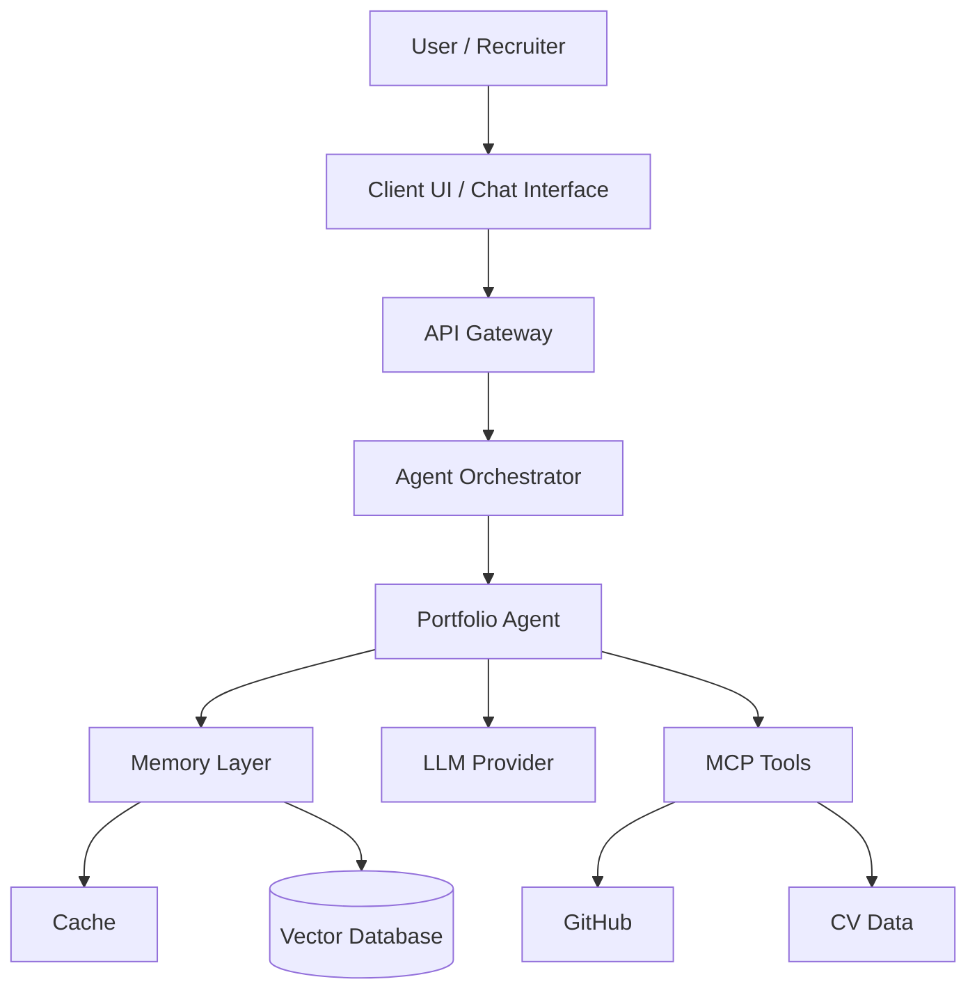
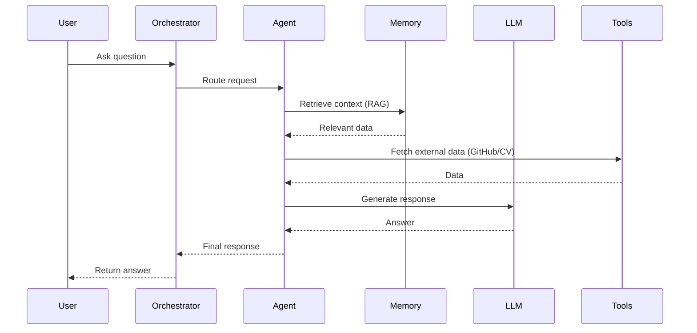

# 🚀 AI Portfolio Agent

An AI-powered portfolio assistant that allows recruiters to explore a developer’s experience through natural language.

Instead of browsing static CVs or GitHub repositories, users can interact with an intelligent agent that understands context and provides relevant answers.

---

## 🧠 Overview

This project implements an **AI Agent-based system** that aggregates data from multiple sources (GitHub, CV, external tools) and enables conversational exploration using **LLM + RAG (Retrieval-Augmented Generation)**.

---

## 🎯 Problem

Traditional portfolios are static:
- Recruiters spend limited time scanning CVs
- Important technical details are often missed
- No interactive way to explore candidate capabilities

---

## 💡 Solution

This system introduces an **Agentic Portfolio Experience**:

- 💬 Ask questions naturally  
- 🧠 AI understands context  
- 🔍 Retrieves relevant information  
- ⚡ Generates precise answers  

---

## 🏗️ System Architecture (C4 - Container Level)

## 🔄 Agent Flow

## 🧩 Components

The system is designed following a modular, agent-based architecture. Each component has a clear responsibility and can be extended independently.

---

### 🧠 Agent Orchestrator

The central coordination layer of the system.

**Responsibilities:**
- Receive and interpret user requests
- Route tasks to appropriate agents
- Manage execution flow and context lifecycle
- Aggregate responses from agents

**Why it matters:**
- Enables scalability (multi-agent support)
- Decouples client from internal logic
- Acts as the “brain” of the system

---

### 🤖 Portfolio Agent

The core intelligent agent responsible for answering user queries.

**Responsibilities:**
- Understand natural language input
- Retrieve relevant context from memory (RAG)
- Decide when to call external tools
- Generate final responses using LLM

**Capabilities:**
- Question answering
- Context-aware reasoning
- Tool usage (GitHub, CV data)

---

### 🧠 Memory Layer

Handles both short-term and long-term memory for the system.

**Components:**
- **Cache (Short-term memory):**
  - Stores recent interactions
  - Improves response speed
  - Maintains conversational context

- **Vector Database (Long-term memory):**
  - Stores embeddings of documents (CV, GitHub data)
  - Enables semantic search (RAG)
  - Supports context retrieval for LLM

**Why it matters:**
- Allows the system to “remember” and reason over data
- Improves accuracy and relevance of responses

---

### 🔧 Tool Integration Layer (MCP)

Provides access to external data sources through standardized interfaces.

**Examples:**
- GitHub repositories
- CV / structured profile data
- Other extensible APIs

**Responsibilities:**
- Fetch real-time or structured data
- Normalize data for agent consumption
- Extend system capabilities beyond static knowledge

**Why it matters:**
- Transforms the agent from static chatbot → dynamic system
- Enables real-world use cases

---

### 🤖 LLM Provider

Handles natural language understanding and generation.

**Responsibilities:**
- Interpret user intent
- Generate human-like responses
- Perform reasoning based on provided context

**Examples:**
- OpenAI APIs
- Other LLM providers

**Why it matters:**
- Core intelligence engine of the system
- Works together with RAG to improve accuracy

---

### 🌐 API Layer

Exposes system functionality to external clients.

**Responsibilities:**
- Provide endpoints for chat interaction
- Handle request/response lifecycle
- Validate input and manage errors

**Why it matters:**
- Enables integration with UI, chatbot interfaces, or external systems

---

### 💬 Client Interface (Optional)

User-facing interface for interacting with the system.

**Examples:**
- Web chat UI
- CLI interface
- Integration with messaging platforms

**Responsibilities:**
- Capture user input
- Display responses
- Provide interactive experience

---

## 🧠 Design Principles

- **Modularity:** Each component can evolve independently  
- **Scalability:** Easily extend to multi-agent architecture  
- **Separation of Concerns:** Clear boundaries between layers  
- **Extensibility:** New tools and agents can be added without breaking the system  

---
## 🧪 Example Use Cases
- “What projects has Tung worked on?”
- “Explain his experience with microservices”
- “Does he have experience with AI systems?”
- “What technologies does he use in backend development?”

## 🛠️ Tech Stack
- Backend: .NET
- AI/LLM: OpenAI / LLM APIs
- Architecture: Clean Architecture, DI
- Data: Vector Database (RAG)
- Integration: MCP (GitHub, CV)
