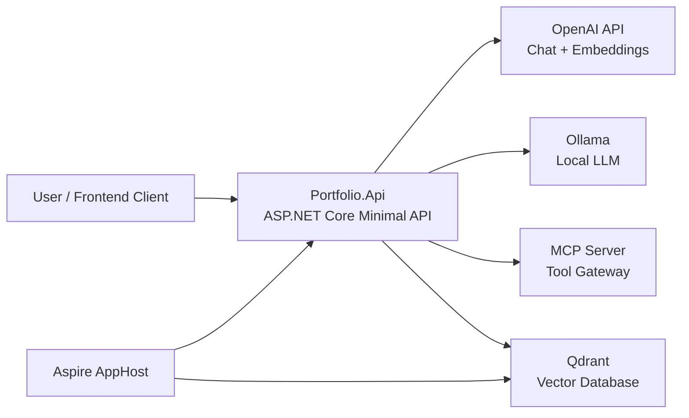
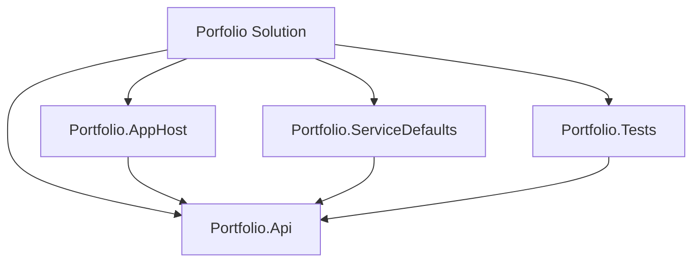
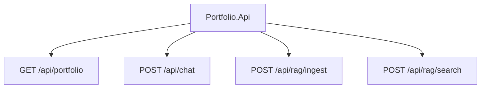
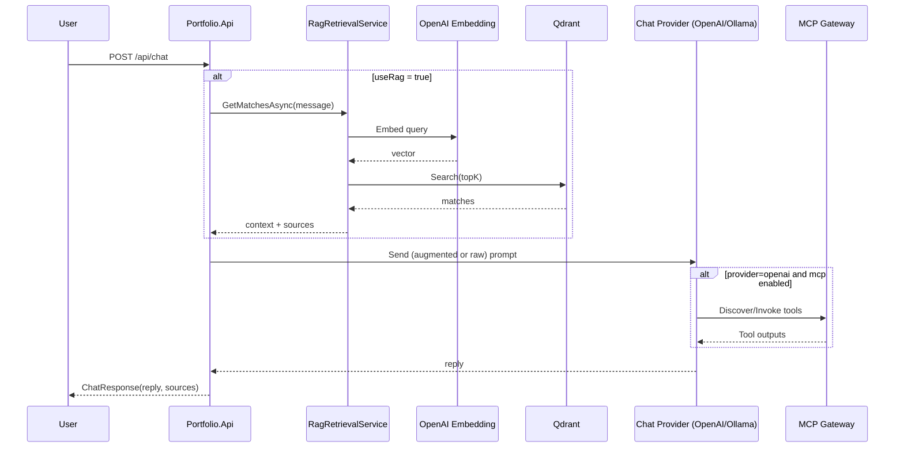
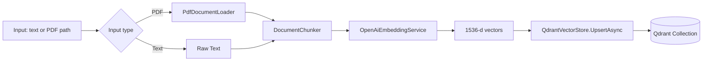
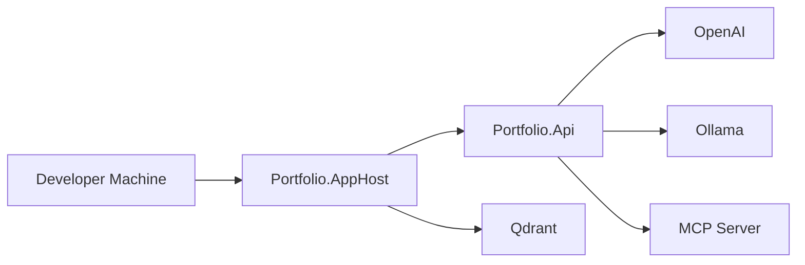

# System Architecture

This document visualizes the current `Porfolio` backend architecture.

## 1. High-Level Context

## 2. Solution Structure

## 3. API Endpoint Map

## 4. Chat Flow (Optional RAG + MCP)

## 5. RAG Ingestion Pipeline

## 6. Deployment / Runtime View

## Notes

- OpenAPI and Scalar docs are enabled in Development.
- `/api/rag/ingest` requires `X-API-Key`.
- Chat endpoint is rate-limited.
- Observability is provided via `Portfolio.ServiceDefaults` (OpenTelemetry + health checks).
